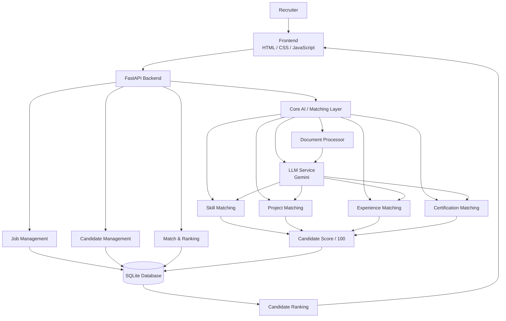

This project is about developing AI Recruiter Platform for recruiters to manage dashboard and easily shortlist the candidates based on their resumes corresponding to the job description.

The Problem:-

- Managing many applications can be time consuming
- It often includes human bias

The Solution:-

AI based screening that ranks candidates based on their score out of 100 for a particular job description and help in real time shortlisting.

---

## Features

- AI-based shortlisting
- Deterministic scoring system combined with LLM's capability to understand language
- Detailed breakdown of a particular candidate

---


## Architecture

# AI Recruiter Platform

This project is about developing an **AI Recruiter Platform** for recruiters to manage their dashboard and easily shortlist candidates based on their resumes corresponding to the job description.

## The Problem

- Managing many applications can be time consuming.
- It often includes human bias.

## The Solution

AI-based screening that ranks candidates based on their score out of 100 for a particular job description and helps in real-time shortlisting.

---

## Features

- AI-based shortlisting
- Deterministic scoring system combined with LLM's capability to understand language
- Detailed breakdown of a particular candidate

---

## Architecture



---

## Project Structure

AI-Recruiter-Platform/
│
├── backend/
│   ├── models/
│   │   ├── candidate.py
│   │   ├── job_model.py
│   │   └── matches.py
│   │
│   ├── routes/
│   │   ├── candidates.py
│   │   ├── jobs.py
│   │   ├── matches.py
│   │   └── ranking.py
│   │
│   ├── schemas/
│   │   ├── candidate_schema.py
│   │   ├── job_schema.py
│   │   └── match_schema.py
│   │
│   ├── services/
│   │   ├── candidate_service.py
│   │   ├── document_service.py
│   │   └── jd_service.py
│   │
│   ├── database.py
│   └── create_tables.py
│
├── core/
│   ├── candidate_ranking_service.py
│   ├── candidate_scoring_service.py
│   ├── certification_matching_service.py
│   ├── document_processor.py
│   ├── education_matching_service.py
│   ├── embeddings_service.py
│   ├── experience_matching_service.py
│   ├── llm_service.py
│   ├── normalization_service.py
│   ├── project_matching_service.py
│   └── skill_matching_service.py
│
├── frontend/
│   ├── index.html
│   ├── jobs.html
│   ├── create-job.html
│   ├── add-candidate.html
│   ├── script.js
│   └── style.css
│
├── uploads/
│   ├── jds/
│   └── resumes/
│
|
├── data/
|
├──schemas/
|   |── candidate.py
|   |── job.py
|
├── utils/
│   └── config.py
|   |- prompts.py
│
├── main.py
├── test.py
├── requirements.txt
├── .gitignore
└── README.md

---

## Setup Guide

1. Clone the repository.

2. Initialize virtual environment.

```
powershell

python -m venv venv

set-ExecutionPolicy -ExecutionPolicy RemoteSigned -Scope Process (if windows block it)

```

3. Initialize backend using uvicorn

```powershell

uvicorn main:app

```

4. Run the Live Server or use integrated browser

---

## Limitations

- Right now, it doesn't have the strength and weakness explaination of the candidate.
- Education is not taken into the final breakdown, keeping in mind that companies prefer skills and projects.
- No Agentic system

## Future Improvements

- Add 2-layer filtering such as candidates required a particular YOE before they can be further considered.
- Agentic architecture where Agents can work dynamically
- Production environment deployed on Docker, Linux, etc.


